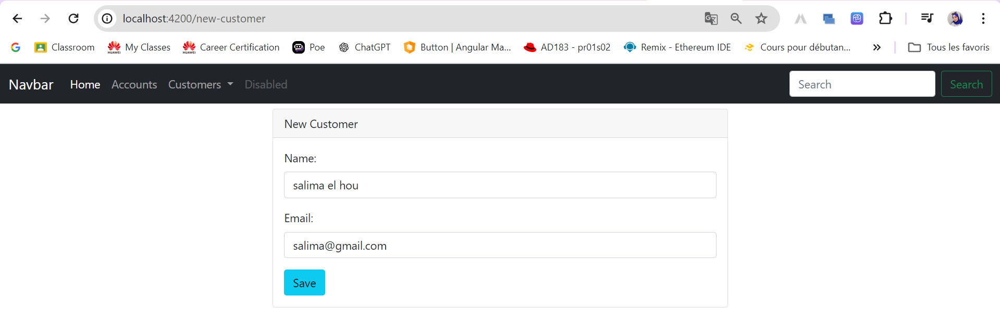
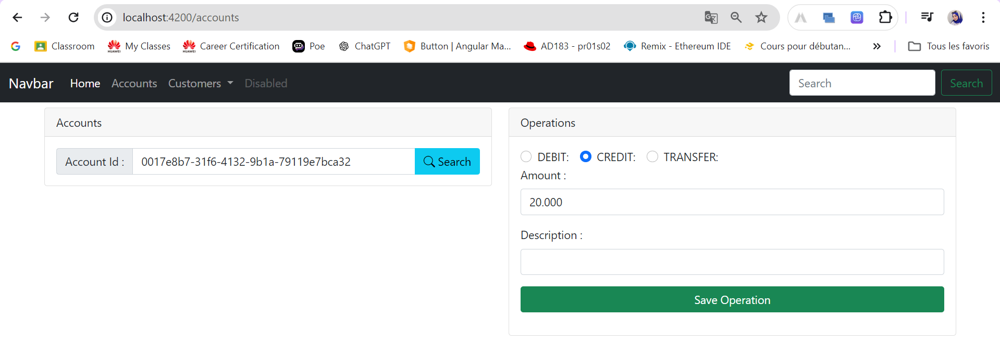
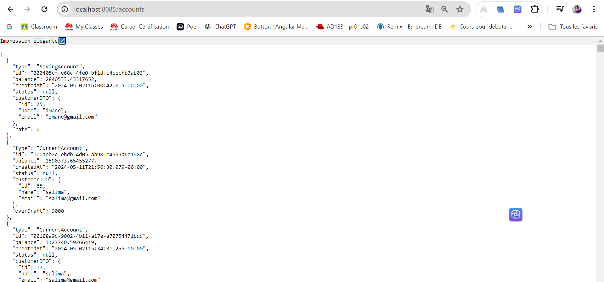
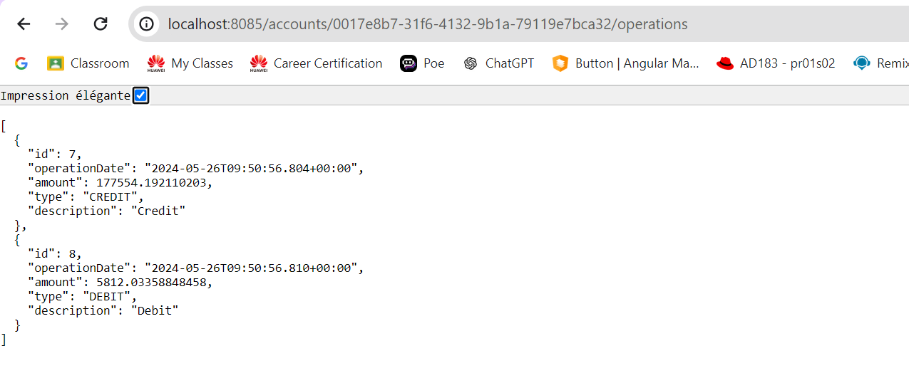
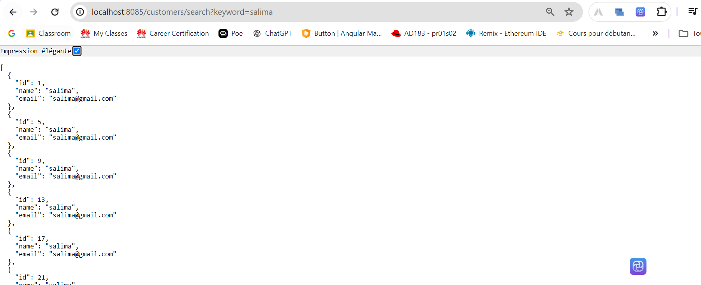

## Salma EZACCANI
# Ebanking 
Application qui permet de gérer des comptes bancaires. 
chaque compte appartient à un client. 
un compte peut subir plusieurs opérations de type DEBIT ou CREDIT.
Il existe deux types de comptes : Comptes courants et comptes épargnes.
## Les tâches réalisées
- Réalisation du back-end avec Spring (framework Java) et une base de données MySQL.
- Réalisation du front-end avec le framework Angular.
- Tests des opérations principales.
## Détails supplémentaires
### Back-end :

- Configuration et mise en place d'une base de données MySQL.
- Création d'API RESTful avec Spring Boot pour gérer les opérations CRUD (Créer, Lire, Mettre à jour, Supprimer).
- Implémentation des services et des contrôleurs pour l'application.
### Front-end :

- Utilisation d'Angular pour construire des composants dynamiques et interactifs.
- Mise en place de formulaires réactifs pour la recherche et la gestion des clients.
- Intégration des services HTTP pour la communication avec le back-end.
### Tests :

- Tests des opérations principales pour assurer le bon fonctionnement de l'application.
- Vérification des interactions entre le front-end et le back-end.
- Validation des fonctionnalités de création, de mise à jour, de suppression et de recherche des clients.
Ces tâches ont permis de créer une application complète et fonctionnelle, intégrant un back-end robuste et un front-end interactif.
## Demo

